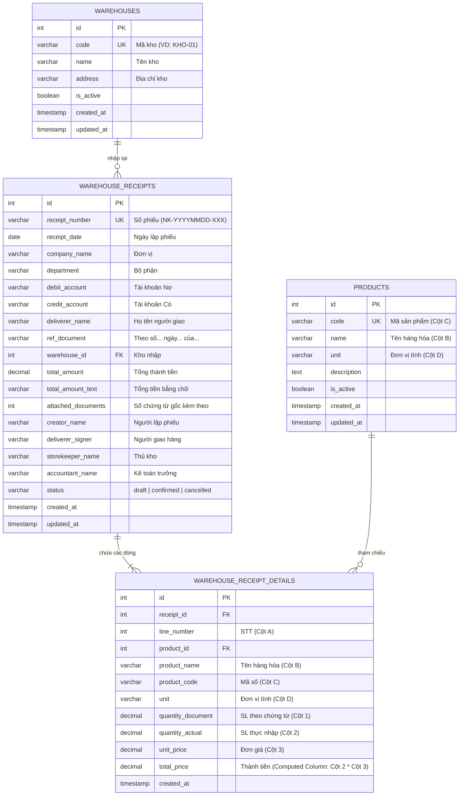

# HỆ THỐNG QUẢN LÝ TỒN KHO VIMES - PHIẾU NHẬP KHO (MẪU 01-VT)

> **Dự án:** Quản lý tồn kho và lập chứng từ Phiếu Nhập Kho theo chuẩn kế toán Việt Nam (**Mẫu số 01 - VT** ban hành theo Thông tư số 200/2014/TT-BTC ngày 22/12/2014 của Bộ Tài chính).

---

## 📌 MỤC LỤC

1. [Giới Thiệu Dự Án](#-giới-thiệu-dự-án)
2. [Công Nghệ & Kiến Trúc](#-công-nghệ--kiến-trúc)
3. [Tính Năng Nổi Bật](#-tính-năng-nổi-bật)
4. [Cấu Trúc Cơ Sở Dữ Liệu](#-cấu-trúc-cơ-sở-dữ-liệu)
5. [Cấu Trúc Dự Án](#-cấu-trúc-dự-án)
6. [Hướng Dẫn Cài Đặt & Chạy](#-hướng-dẫn-cài-đặt--chạy)
7. [Tài Liệu API Endpoints](#-tài-liệu-api-endpoints)
8. [Kiểm Thử & Đo Lường Độ Bao Phủ (Testing)](#-kiểm-thử--đo-lường-độ-bao-phủ-testing)
9. [Biểu Mẫu In Chứng Từ](#-biểu-mẫu-in-chứng-từ)

---

## 📖 GIỚI THIỆU DỰ ÁN

Khách hàng **VIMES** yêu cầu xây dựng chương trình quản lý kho hàng với phân hệ quản lý và lập **Phiếu Nhập Kho** đúng theo quy định pháp lý kế toán hiện hành của Bộ Tài chính.

### Đáp ứng đầy đủ 4 yêu cầu bài test:
1. **Thiết kế CSDL quan hệ chuẩn:** PostgreSQL với khóa ngoại, chỉ mục (indexes), ràng buộc (constraints), trigger tự động tính tổng tiền và cột tự sinh (computed column).
2. **Giao diện nhập liệu tương tác cao:** Tái hiện 100% bố cục Mẫu 01-VT, hỗ trợ thêm/xóa dòng hàng hóa động, tìm kiếm nhanh (autocomplete), tính toán thành tiền thời gian thực và tự động dịch số tiền thành chữ tiếng Việt.
3. **Xử lý nghiệp vụ & lưu trữ an toàn:** Kiến trúc 3 lớp với Node.js + TypeScript + Express. Sử dụng raw SQL với thư viện `pg` (libpq) và xử lý giao dịch dữ liệu toàn vẹn (ACID Transactions).
4. **Kiểm thử tự động:** Bộ kiểm thử toàn diện với Jest và Supertest bao phủ 100% các layer (80/80 tests PASS, coverage ~85%).

---

## 🛠 CÔNG NGHỆ & KIẾN TRÚC

| Thành phần | Công nghệ sử dụng | Mục đích |
|---|---|---|
| **Runtime** | Node.js (LTS v18+) | Môi trường thực thi JavaScript/TypeScript |
| **Ngôn ngữ** | TypeScript 5.x | Đảm bảo tính an toàn kiểu dữ liệu (Type-Safe) |
| **Web Framework** | Express.js 4.x | RESTful API & Server-Side Routing |
| **Cơ sở dữ liệu** | PostgreSQL 16 | Hệ quản trị CSDL quan hệ mạnh mẽ |
| **DB Client** | `pg` (node-postgres / libpq) | Thao tác Raw SQL theo yêu cầu libpq, không dùng ORM |
| **Validation** | Zod | Kiểm tra tính hợp lệ của dữ liệu đầu vào |
| **Template Engine** | EJS | Render giao diện phía máy chủ |
| **Styling** | Vanilla CSS | Design System chuyên nghiệp, tối ưu `@media print` |
| **Testing** | Jest + Supertest | Unit test và Integration test tự động |

### Kiến trúc phân tầng (Layered Architecture):
```
[Client (Browser / API Consumer)]
               │
               ▼
      [Express Router & Middleware]
               │ (Zod Validation, Error Handler)
               ▼
         [Controllers]
               │ (HTTP Request / Response formatting)
               ▼
          [Services]
               │ (Business Logic: Validations, Calculations, Number-to-Words)
               ▼
        [Repositories]
               │ (Raw SQL, Query Execution, ACID Transactions)
               ▼
     [PostgreSQL Database (libpq)]
```

---

## ✨ TÍNH NĂNG NỔI BẬT

-  **Bố cục chuẩn Mẫu 01-VT:** Thể hiện đầy đủ Header, Thông tin chứng từ gốc, Bảng chi tiết 8 cột (A, B, C, D, 1, 2, 3, 4), Dòng Cộng và 4 khối chữ ký (Người lập, Người giao, Thủ kho, Kế toán trưởng).
- 📑 **Hệ thống Phân trang thông minh (Smart Pagination):**
  - Hỗ trợ đổi số lượng hiển thị linh hoạt: **5, 10, 20, 50 dòng/trang**.
  - Các nút số trang trực tiếp `[1]`, `[2]`, `[3]`, `...`, `[N]`, nút Trang đầu `«`, Trang cuối `»`.
  - Tự động bảo toàn toàn bộ bộ lọc và từ khóa tìm kiếm khi chuyển trang.
- ⚡ **Thao tác dòng động (Dynamic Rows):** Thêm và xóa dòng hàng hóa không giới hạn, tự động đánh số lại cột STT.
- 🔍 **Autocomplete vật tư:** Gõ tên hoặc mã hàng hóa để gợi ý và tự động điền Mã số (C), Đơn vị tính (D).
- 🧮 **Tự động tính toán (Live Calculation):**
  - Cột 4 (Thành tiền) = Cột 2 (SL Thực nhập) × Cột 3 (Đơn giá).
  - Dòng Cộng = Tổng thành tiền tất cả các dòng.
- ✍️ **Dịch số tiền thành chữ tiếng Việt:** Chuyển đổi chính xác số tiền bất kỳ sang chữ tiếng Việt chuẩn ngữ pháp tài chính kế toán (xử lý chuẩn các trường hợp "mười", "mươi", "lẻ", "lăm", "tư", "mốt", "nghìn", "triệu", "tỷ").
- 🖨 **Chế độ in chứng từ A4 hoàn hảo:** Tích hợp CSS in ấn, ẩn thanh công cụ điều hướng, tối ưu căn lề để in phiếu trực tiếp ra giấy A4 hoặc lưu PDF.
- 🔒 **Quản lý vòng đời phiếu:** Hỗ trợ các trạng thái `draft` (Nháp), `confirmed` (Đã xác nhận), `cancelled` (Đã hủy). Chỉ cho phép sửa/xóa phiếu khi còn ở trạng thái nháp.

---

## 🗄 CẤU TRÚC CƠ SỞ DỮ LIỆU

### Sơ đồ quan hệ thực thể (ERD)



### Điểm nhấn thiết kế CSDL:
1. **Computed Column:** `total_price DECIMAL(18,2) GENERATED ALWAYS AS (quantity_actual * unit_price) STORED` đảm bảo tính toán luôn chính xác ở cấp độ lưu trữ database.
2. **Denormalization:** Lưu trữ độc lập `product_name`, `product_code`, `unit` trong từng dòng chi tiết để đảm bảo phiếu nhập kho giữ nguyên giá trị lịch sử kể cả khi danh mục hàng hóa thay đổi trong tương lai.
3. **Trigger cập nhật tự động:** Trigger `trg_update_receipt_total` tự động đồng bộ giá trị `total_amount` trên bảng Header mỗi khi thêm/sửa/xóa dòng chi tiết.
4. **Trigger cập nhật thời gian:** Trigger `update_updated_at_column` tự động cập nhật trường `updated_at`.

---

## 📁 CẤU TRÚC DỰ ÁN

```
test/
├── dist/                              # Mã nguồn TypeScript sau khi build
├── src/
│   ├── app.ts                         # Cấu hình Express app & middlewares
│   ├── server.ts                      # Khởi động HTTP server
│   ├── database/
│   │   ├── connection.ts              # Connection Pool & Transaction Wrapper (pg/libpq)
│   │   ├── schema.sql                 # DDL bảng, triggers, computed columns, indexes
│   │   ├── seed.sql                   # Dữ liệu khởi tạo (kho, sản phẩm, phiếu mẫu)
│   │   ├── create-db.ts               # Script tạo cơ sở dữ liệu
│   │   ├── migrate.ts                 # Script chạy migration DDL
│   │   └── seed.ts                    # Script nạp seed data
│   ├── models/
│   │   └── types.ts                   # Interfaces, Types, DTOs, Enums
│   ├── validators/
│   │   └── receipt.validator.ts       # Zod schemas kiểm tra dữ liệu
│   ├── utils/
│   │   ├── number-to-words.ts         # Thuật toán chuyển số tiền sang chữ tiếng Việt
│   │   ├── receipt-number.ts          # Bộ sinh số phiếu tự động (NK-YYYYMMDD-XXX)
│   │   └── errors.ts                  # Các lớp lỗi tùy biến (AppError, NotFound,...)
│   ├── repositories/
│   │   ├── warehouse.repository.ts    # Truy vấn Raw SQL cho Warehouses
│   │   ├── product.repository.ts      # Truy vấn Raw SQL cho Products & Search
│   │   └── receipt.repository.ts      # Truy vấn Raw SQL CRUD & ACID Transactions cho Receipts
│   ├── services/
│   │   └── receipt.service.ts         # Nghiệp vụ: tính tổng, dịch chữ, kiểm tra trạng thái
│   ├── controllers/
│   │   ├── receipt.controller.ts      # Xử lý HTTP Request/Response cho Phiếu
│   │   ├── warehouse.controller.ts    # Xử lý HTTP Request/Response cho Kho
│   │   └── product.controller.ts      # Xử lý HTTP Request/Response cho Sản phẩm
│   ├── routes/
│   │   ├── index.ts                   # Gom nhóm router
│   │   ├── receipt.routes.ts          # Các route API /api/receipts/*
│   │   ├── warehouse.routes.ts        # Các route API /api/warehouses/*
│   │   ├── product.routes.ts          # Các route API /api/products/*
│   │   └── page.routes.ts             # Các route giao diện Web (EJS)
│   ├── middleware/
│   │   ├── error-handler.ts           # Middleware bắt và xử lý lỗi tập trung
│   │   └── validate.ts                # Middleware xác thực dữ liệu qua Zod
│   ├── views/                         # Giao diện EJS Templates
│   │   ├── layouts/
│   │   ├── partials/
│   │   │   ├── header.ejs             # Header điều hướng & Toast container
│   │   │   └── footer.ejs             # Footer thông tin chuẩn VAS
│   │   └── pages/
│   │       ├── receipt-list.ejs       # Bảng danh sách phiếu, bộ lọc & phân trang
│   │       ├── receipt-form.ejs       # Form nhập/sửa phiếu chuẩn Mẫu 01-VT
│   │       ├── receipt-detail.ejs     # Xem chi tiết và in ấn chuẩn A4
│   │       └── 404.ejs                # Giao diện trang 404
│   ├── public/                        # Static Assets
│   │   ├── css/
│   │   │   └── style.css              # Design System & Quy tắc in ấn (@media print)
│   │   └── js/
│   │       └── receipt-form.js        # Logic client: Dynamic table, autocomplete, live sum
│   └── __tests__/                     # Bộ kiểm thử tự động (80 tests)
│       ├── setup.ts                   # Cấu hình test database
│       ├── utils/                     # Test number-to-words, receipt-number
│       ├── validators/                # Test Zod schemas
│       ├── services/                  # Test business logic
│       ├── repositories/              # Test Raw SQL repositories & transactions
│       ├── controllers/               # Test RESTful API endpoints với Supertest
│       └── routes/                    # Test Web page rendering & pagination
├── jest.config.ts                     # Cấu hình Jest
├── tsconfig.json                      # Cấu hình TypeScript compiler
├── package.json                       # Dependencies & npm scripts
├── .env.example                       # Biến môi trường mẫu
└── README.md                          # Tài liệu hướng dẫn dự án
```

---

## 🚀 HƯỚNG DẪN CÀI ĐẶT & CHẠY

### 1. Yêu cầu hệ thống
- **Node.js:** Phiên bản ≥ 18 (Khuyến nghị LTS v20 hoặc v22)
- **PostgreSQL:** Phiên bản ≥ 14 (Có thể chạy trực tiếp hoặc qua Docker)

### 2. Cấu hình môi trường
Tạo file `.env` từ file mẫu `.env.example`:
```bash
cp .env.example .env
```

Nội dung `.env`:
```env
PORT=3000
NODE_ENV=development

# Cấu hình PostgreSQL
DB_HOST=localhost
DB_PORT=5432
DB_NAME=vimes_warehouse
DB_USER=postgres
DB_PASSWORD=postgres

# Cấu hình Database cho kiểm thử
TEST_DB_NAME=vimes_warehouse_test
```

### 3. Khởi động PostgreSQL bằng Docker (Tiện lợi & Nhanh chóng)
Nếu chưa có sẵn PostgreSQL trên máy, bạn chỉ cần chạy lệnh sau:
```bash
docker run -d --name vimes-postgres \
  -p 5432:5432 \
  -e POSTGRES_USER=postgres \
  -e POSTGRES_PASSWORD=postgres \
  -e POSTGRES_DB=vimes_warehouse \
  postgres:16-alpine
```

### 4. Cài đặt thư viện dependencies
```bash
npm install
```

### 5. Khởi tạo Cơ sở dữ liệu và nạp dữ liệu mẫu
Lệnh sau sẽ tạo DB, chạy DDL schema (4 bảng, triggers, indexes) và seed sẵn dữ liệu mẫu:
```bash
npm run db:reset
```

### 6. Khởi chạy ứng dụng
#### Chế độ phát triển (Development):
```bash
npm run dev
```

#### Chế độ sản xuất (Production):
```bash
npm run build
npm start
```

### 7. Truy cập ứng dụng:
- **Giao diện Web:** [http://localhost:3000](http://localhost:3000)
- **Lập phiếu nhập kho mới (01-VT):** [http://localhost:3000/receipts/new](http://localhost:3000/receipts/new)
- **API Base URL:** `http://localhost:3000/api`

---

## 📡 TÀI LIỆU API ENDPOINTS

### 1. Phân hệ Phiếu Nhập Kho (`/api/receipts`)

| Phương thức | Đường dẫn | Mô tả |
|---|---|---|
| `GET` | `/api/receipts` | Lấy danh sách phiếu (hỗ trợ lọc `from_date`, `to_date`, `warehouse_id`, `status`, `search` và phân trang `page`, `limit`) |
| `GET` | `/api/receipts/:id` | Lấy thông tin chi tiết đầy đủ 1 phiếu nhập kho (gồm header, danh sách vật tư và kho) |
| `POST` | `/api/receipts` | Tạo phiếu nhập kho mới (Tự động sinh số phiếu, tính tiền và dịch thành chữ trong 1 Transaction) |
| `PUT` | `/api/receipts/:id` | Cập nhật thông tin phiếu nhập kho (Chỉ áp dụng khi phiếu ở trạng thái `draft`) |
| `DELETE` | `/api/receipts/:id` | Xóa phiếu nhập kho (Chỉ áp dụng cho phiếu `draft`) |
| `PATCH` | `/api/receipts/:id/confirm` | Xác nhận phiếu nhập kho (`draft` $\rightarrow$ `confirmed`) |
| `PATCH` | `/api/receipts/:id/cancel` | Hủy phiếu nhập kho (`draft` $\rightarrow$ `cancelled`) |
| `POST` | `/api/receipts/amount-to-text` | Tiện ích: Chuyển đổi số tiền bất kỳ thành chữ tiếng Việt |

#### Payload mẫu tạo Phiếu Nhập Kho (`POST /api/receipts`):
```json
{
  "receipt_date": "2026-08-18",
  "company_name": "Công ty Cổ phần Công nghệ VIMES",
  "department": "Phòng Kế hoạch & Sản xuất",
  "debit_account": "152",
  "credit_account": "331",
  "deliverer_name": "Nguyễn Văn Toàn",
  "ref_document": "Hóa đơn GTGT số 0001234 ngày 15/08/2026",
  "warehouse_id": 1,
  "attached_documents": 2,
  "creator_name": "Trần Thị Bình",
  "deliverer_signer": "Nguyễn Văn Toàn",
  "storekeeper_name": "Lê Văn Cường",
  "accountant_name": "Phạm Thị Dung",
  "details": [
    {
      "product_id": 1,
      "product_name": "Thép tấm SS400 dày 3mm",
      "product_code": "NVL-001",
      "unit": "Tấm",
      "quantity_document": 50,
      "quantity_actual": 50,
      "unit_price": 350000
    },
    {
      "product_id": null,
      "product_name": "Que hàn chịu lực E7018",
      "product_code": "NVL-008",
      "unit": "Kg",
      "quantity_document": 20,
      "quantity_actual": 20,
      "unit_price": 45000
    }
  ]
}
```

### 2. Phân hệ Danh mục Kho & Hàng hóa Master Data

| Phương thức | Đường dẫn | Mô tả |
|---|---|---|
| `GET` | `/api/warehouses` | Lấy danh sách tất cả các kho đang hoạt động |
| `GET` | `/api/warehouses/:id` | Lấy thông tin chi tiết 1 kho |
| `GET` | `/api/products` | Lấy danh mục sản phẩm / vật tư |
| `GET` | `/api/products/search?q={keyword}` | Tìm kiếm nhanh sản phẩm theo tên hoặc mã (dùng cho autocomplete) |

---

## 🧪 KIỂM THỬ & ĐO LƯỜNG ĐỘ BAO PHỦ (TESTING)

Dự án trang bị hệ thống kiểm thử tự động toàn diện với **80 test cases** thuộc **8 Test Suites**.

### Chạy toàn bộ Test Suites:
```bash
npm test
```

### Chạy kiểm thử kèm Báo cáo Coverage:
```bash
npm run test:coverage
```

### Kết quả Coverage:
```text
PASS src/__tests__/routes/pagination.test.ts
PASS src/__tests__/controllers/receipt.controller.test.ts
PASS src/__tests__/validators/receipt.validator.test.ts
PASS src/__tests__/routes/page.routes.test.ts
PASS src/__tests__/repositories/receipt.repository.test.ts
PASS src/__tests__/services/receipt.service.test.ts
PASS src/__tests__/utils/number-to-words.test.ts
PASS src/__tests__/utils/receipt-number.test.ts

-------------------|---------|----------|---------|---------|
File               | % Stmts | % Branch | % Funcs | % Lines |
-------------------|---------|----------|---------|---------|
All files          |   84.79 |    67.17 |   87.69 |   84.49 |
 src               |   92.59 |    42.85 |     100 |   92.59 |
 src/controllers   |   64.64 |    64.28 |      75 |   64.64 |
 src/database      |   79.31 |    38.88 |      60 |   79.31 |
 src/middleware    |   65.71 |       25 |     100 |    64.7 |
 src/models        |     100 |      100 |     100 |     100 |
 src/repositories  |   94.49 |    79.66 |     100 |   94.33 |
 src/routes        |    92.5 |     62.5 |     100 |    92.4 |
 src/services      |   79.66 |    41.66 |    90.9 |   79.66 |
 src/utils         |   98.75 |    93.02 |   88.88 |   98.66 |
 src/validators    |     100 |      100 |     100 |     100 |
-------------------|---------|----------|---------|---------|
Test Suites: 8 passed, 8 total
Tests:       80 passed, 80 total
Snapshots:   0 total
Time:        4.0s
```

---

## 🖨 BIỂU MẪU IN CHỨNG TỪ

Hệ thống được thiết kế theo đúng quy cách **Mẫu 01 - VT**:
- Đơn vị, Bộ phận, Tiêu đề mẫu ban hành theo Thông tư 200/2014/TT-BTC.
- Ngày, tháng, năm lập phiếu và định khoản kế toán (Nợ / Có).
- Thông tin người giao, chứng từ gốc, kho nhập và địa điểm.
- Bảng danh mục vật tư: STT (A), Tên nhãn hiệu quy cách (B), Mã số (C), ĐVT (D), SL theo chứng từ (1), SL thực nhập (2), Đơn giá (3), Thành tiền (4).
- Dòng Tổng cộng, Tổng số tiền viết bằng chữ tiếng Việt, Số lượng chứng từ gốc kèm theo.
- 4 vị trí chữ ký: **Người lập phiếu**, **Người giao hàng**, **Thủ kho**, **Kế toán trưởng**.
- Trang in tự động ẩn toàn bộ header, sidebar, nút bấm khi thực hiện lệnh in (`Ctrl + P` / `Cmd + P` hoặc nút *"In Phiếu Nhập Kho"*).

---

## 👨‍💻 TÁC GIẢ & BẢN QUYỀN

- **Dự án:** Bài Test Quản Lý Tồn Kho VIMES - Phiếu Nhập Kho (Mẫu 01-VT)
- **Tác giả:** Đội ngũ Kỹ thuật Phát triển Phần mềm
- **Giấy phép:** MIT License
